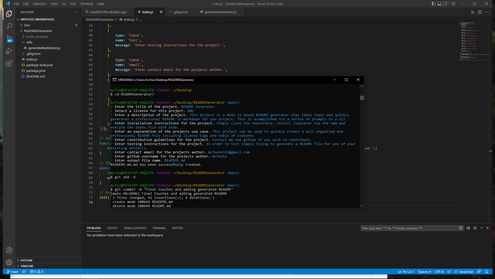

# README Generator

  ## Table of Contents
  *[License](#license)
  *[About](#about)
  *[Installation](#installation)
  *[Usage](#usage)
  *[Testing](#testing)
  *[Contribution](#contribution)
  *[Questions](#questions)

  ## Badges
  

  ## License
  You may read more about the GNU here: 
  (https://www.gnu.org/licenses/gpl-3.0)

  ## About
  This project is a Node.js based README generator that takes input and quickly generates a professional README in markdown for you project. This is acomplished via a series of prompts in a CLI.

  ## Installation
  Simply clone the repository, install inquierer via the npm and execute the index file with node.

  ## Usage
  This project can be used to quickly create a well organized and professional README file including license tags and table of contents

  ## Testing
  In order to test simply trying to generate a README file for one of your existing projects.

  ## Contribution
  Contact me one github if you wish to contribute.

  ## Questions
  mcfoote321@gmail.com
  [undefined](https://github.com/undefined)

  Video link: https://drive.google.com/file/d/1DNbvDJ_UEIDyYCw8QuNKntiT0NfMNm_e/view?usp=sharing
  
  
  
